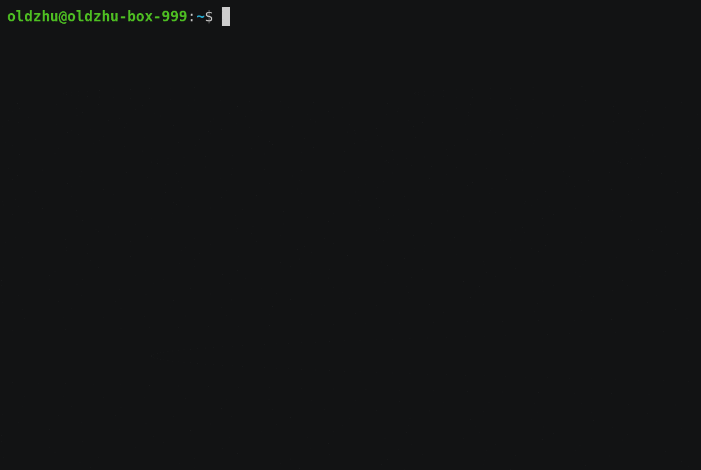

# 4dotnet
The repository is building a Linux arm/arm64 VM in WSL2 so you can play with .NET core debugging on arm/arm64 system as the below without buying a real hardware. 

Two goals of the project:  
1. Lower the gate to play .net core app on Linux arm/arm64.
2. Provide a "All-In-One" package and a "Full Stack" experience (source code level debugging at every layer, from host-qemu,linux kernel,lldb/gdb,sos,.net core app)

The target arm/arm64 VM contains:

- The linux system (5.12) - build by the buildroot gcc toolchain
- The gdb (10.x) - build by the buildroot gcc toolchain
- The lldb (main branch) - build by the buildroot gcc toolchain
- The SOS lldb plugin (main branch) - build by the clang/llvm(for native part) + MS compilers(for managed part)
- A selfcontained .NET core applciation with the .NET core runtime (main branch) - build by the host clang/llvm(for native part) and MS compilers(for managed part))

Also have the following tools built for the host x86-64:

* The qemu (5.2.0) - build by the buildroot gcc toochain, which is used to host the arm/arm64 vm built.  
* The latest clang/llvm (main branch) - build by buildroot gcc toolchain, which is used to cross compile the above SOS lldb plugin and the native part of the .NET core runtime for arm/arm64 target.  

1. [build arm/arm64 VM (Linux + GDB + LLDB + SOS + .NET Core applcation)](documents/build.md)  
2. [.net core app on arm64 vm debugging](documents/debug-arm64-netcoreapp.md)
3. [.net core app on arm vm debugging](documents/debug-arm-netcoreapp.md)
4. [publish a .net core app to vm for debugging](documents/publish.md)
5. [host qemu debugging](documents/debug-qemu.md)
6. [linux lernel debugging](documents/debug-linux-kernel.md)
7. [lldb sos plugin debugging](documents/debug-lldb-sos.md)